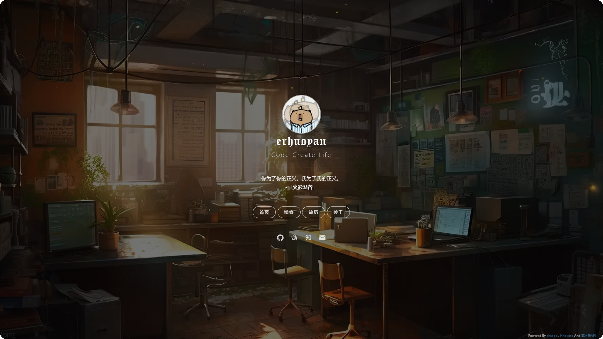
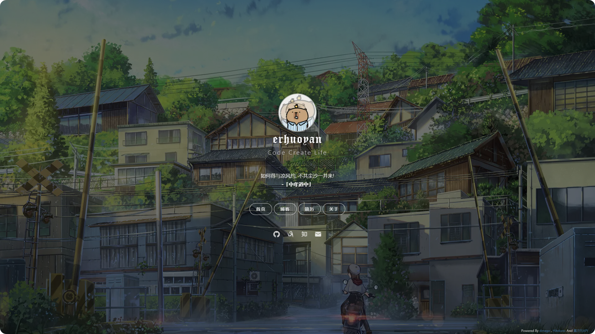

# homepage

> 原作者[dmego](https://i.dmego.cn/)

#### 介绍
我的个人主页

- 访问地址：[个人主页](https://erhuoyan.cn)
- 更改原作者的bing壁纸
- 通过[栗次元](https://t.alcy.cc/)获取壁纸

#### 效果图

 

#### 使用说明

- 定时执行getimage.sh脚本下载壁纸到assets/img/目录下
- 壁纸展示在main.js中实现
- 定制化主要修改index.html文件
- 可修改getimage.py更换壁纸接口

#### 更新记录
- 2024-08-02
    - 增加底部备案信息功能，调整脚本执行文件getimage.sh
- 2024-08-01
    - 使用Fetch API调用一言接口
- 2024-07-31
    - 编写getimage.py脚本，更换壁纸接口
